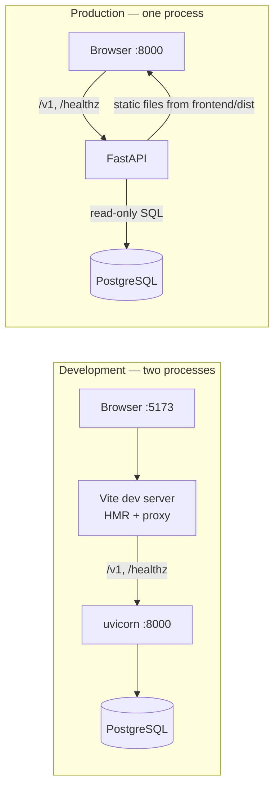

# SPEC — insurance-text2sql frontend

A single-page web UI for the text-to-SQL service: type a question, see the answer,
the executed SQL, and the result table.

> Demo only. All data are fictional.

> **Relationship to [SPEC.md](SPEC.md).** This document is an addendum covering the
> frontend layer only. SPEC.md remains the single source of truth for everything it
> already covers — pipeline semantics, security (§5.4, §4.3), the HTTP API (§7.2),
> evaluation (§6), configuration (§8). Where the two documents overlap, SPEC.md
> wins. The frontend adds **no new trust boundary**: it is a display layer over the
> existing `POST /v1/query` endpoint and introduces no new endpoints, no backend
> behavior changes, and no new secrets. The only SPEC.md change made by this work
> is the §9 amendment registering `frontend/`, this document, and the new Make
> targets in the directory layout; every other section of SPEC.md is untouched.

---

## 1. Overview

Goals:

- **Fast to build, fast to run**: Vite (not Webpack) — zero-config scaffold,
  native-ESM dev server with instant HMR, rollup production build. The production
  artifact is plain static files served by the existing FastAPI process.
- **One process in production**: `vite build` → `frontend/dist/` → mounted by
  FastAPI. No nginx, no separate frontend deployment, no Node at runtime.
- **Zero CORS**: in development the Vite dev server proxies API paths to uvicorn,
  so every request is same-origin. FastAPI gains no CORS middleware.
- **Backend untouched**: `make test` stays offline and Python-only. A fresh clone
  without Node still runs the entire existing pipeline; the frontend is purely
  additive.

## 2. Scope

### 2.1 Supported

- Single-page question form → `POST /v1/query` (SPEC.md §7.2) → rendered result.
- Rendering of every terminal state of the pipeline:
  - `action=sql` — answer text, collapsible normalized SQL, result table with
    dynamic columns, truncation notice when `truncated=true`.
  - `action=clarify` — the clarification question, with a hint that the user
    should re-ask in full (no conversation memory, SPEC.md §2.2).
  - `action=refuse` — the refusal text.
  - `error` non-null — honest-failure view (HTTP is still 200; SPEC.md §7.2),
    **checked before `action`** — after retry exhaustion `action` may still
    read `"sql"` (§4.2).
  - transport errors (network failure, non-2xx) — distinct from honest failure.
- A `debug` toggle: sends `debug=true` and renders the returned `trace` as a
  step list (node, duration, digests).
- UI copy in Chinese, matching the language of the answerer's output.

### 2.2 Not supported

Everything SPEC.md §2.2 excludes stays excluded — the frontend does not paper
over backend limitations: no streaming/typewriter effect, no multi-turn context,
no client-side session history persistence, no authentication or multi-tenancy.
Additionally out of scope for the UI itself: charts/visualization, i18n
framework, client-side routing (single view), UI component libraries, CSS
frameworks (plain CSS from the Vite template), SSR, and any separate
frontend hosting (nginx/CDN/Docker image).

## 3. Architecture



- **Development**: `make api` (uvicorn, port 8000) + `make frontend-dev`
  (Vite dev server, port 5173). `vite.config.ts` proxies `/v1` and `/healthz`
  to `http://127.0.0.1:8000`; the page only ever talks to its own origin.
- **Production**: `make frontend-build` writes `frontend/dist/`. `api.py` mounts
  it with `StaticFiles(html=True)` at `/` **after** all API routes are
  registered. The mount exists only if `dist/index.html` is present at app
  startup — auto-detected, no new environment variable. `create_app` gains an
  optional `static_dir` parameter (default: the repo's `frontend/dist`,
  resolved from the module's own path, **not** the process cwd — uvicorn may be
  started from any directory). The parameter exists so tests can inject a stub
  `dist/` from `tmp_path` (§8); production callers never pass it. Without a
  build, the backend behaves exactly as today.

## 4. Frontend Design

### 4.1 View Structure

One page, three regions:

| Region | Content |
|---|---|
| Question form | text input (required, mirrors server `min_length=1`), `debug` checkbox, submit button with pending state |
| Result panel | one of the five states in §2.1, driven by a pure mapping function |
| Trace panel | rendered only when `debug=true` and `trace` is non-empty |

The SQL is shown in a native `<details>` element (collapsed by default) using
the **normalized** SQL from the response — the same string the executor ran,
so the UI can never show an unvalidated statement.

### 4.2 Response Mapping

A pure function maps `QueryResponse` (SPEC.md §7.2) to a view model.

**Dispatch precedence (mandatory):** `error != null` is checked **before**
`action`. The honest-failure node returns `answer` + `trace` only — it neither
clears `action` nor `error_feedback` — so an honest-failure response typically
arrives as `action="sql"` with `error` non-null and `rows=null`; dispatching on
`action` alone would render an empty result table for a failed query.
Conversely, every success path clears `error_feedback` — all four nodes write
`error_feedback: None` on success (the router on a resolved clarify/refuse,
the generator, the validator, and the executor) — so at a terminal state
`error != null` is an exact discriminator:

| Terminal state | `action` | `error` | `rows` |
|---|---|---|---|
| sql success | `"sql"` | null | non-null (possibly `[]`) |
| clarify | `"clarify"` | null | null |
| refuse | `"refuse"` | null | null |
| honest failure | `"sql"` **or** `null` (residual) | non-null | null |

The `action=null` honest-failure row is the router-parse-failure path: retries
exhausted before any `action` was resolved.

```typescript
type QueryResponse = {
  action: "sql" | "clarify" | "refuse" | null
  answer: string | null
  sql: string | null
  rows: Array<Record<string, string | number | boolean | null>> | null
  truncated: boolean
  error: string | null
  trace: Array<Record<string, unknown>>
}
```

- `rows` cells arrive as JSON scalars: `string | number | boolean | null`.
  psycopg returns driver-native values (e.g. `products.is_active` is a
  boolean); pydantic then serializes `Decimal` as lossless strings and dates
  as ISO strings. Each cell renders **verbatim** (`String(cell)`), never
  re-parsed as floats.
- Column headers come from the keys of the first row; the table renders all
  returned rows (the server already caps at `ROW_LIMIT`, SPEC.md §5.4 R6).
- `truncated=true` must render a visible notice, mirroring the answerer's
  truncation disclosure (SPEC.md §5.2).

### 4.3 Honest Failure vs Transport Error

Two distinct error surfaces, never conflated:

- **Honest failure**: HTTP 200 with `error` non-null — the pipeline's own
  admission that the query could not be completed. The **primary copy is
  `answer`**: the backend's deterministic honest-failure composer embeds the
  reason in its user-facing sentence, so `answer` alone is display-complete.
  The `error` field is diagnostic detail (parser error, violated rule ID, or
  first-line DB error) and renders as secondary detail beneath the answer,
  never as the main message.
- **Transport error**: fetch rejection or non-2xx status — the UI's own
  "service unreachable" message. Never fabricated into a pipeline answer.

## 5. Build Tooling

| Choice | Decision | Rationale |
|---|---|---|
| Bundler | Vite (latest stable) | Zero-config scaffold, instant HMR, rollup production build; Webpack only pays off for legacy migration |
| Framework | React + TypeScript (`react-ts` template), strict mode | Official Vite template; adequate for a single-page form/result UI |
| Package manager | npm (bundled with Node) | No extra toolchain; lockfile committed |
| Node | 22 LTS, pinned via `.nvmrc` + `engines` field | Reproducible builds |
| HTTP client | `fetch` API | No axios-level dependency needed |
| Styling | Plain CSS from the template | No Tailwind / UI kit — deliberately minimal |
| Lint / test | oxlint (the template's default — create-vite 9 ships oxlint in place of ESLint) + vitest (**added explicitly** as a devDependency with a `test` script — the template includes no test runner) | Unit-test the pure mapping function; offline |

`node_modules/` and `frontend/dist/` are gitignored; `frontend/package-lock.json`
is committed.

## 6. Commands

New Makefile targets (existing targets unchanged):

| Command | Purpose |
|---|---|
| `make api` | `uv run uvicorn text2sql.api:app --reload --port 8000` (needs DB + API key) |
| `make frontend-dev` | `npm install` if needed, then `npm run dev` (Vite, :5173) |
| `make frontend-build` | `npm run build` → `frontend/dist/` |
| `make frontend-test` | `npm run lint && npm run test` (offline, no DB) |

Development loop: `make api` in one terminal, `make frontend-dev` in another,
open http://localhost:5173.

## 7. Directory Structure

Adds one top-level directory. SPEC.md §9 is amended in the same PR to register
`frontend/`, this document, and the new Make targets; the internal layout below
is governed by this document:

```
frontend/
├── .nvmrc                  # 22
├── .oxlintrc.json          # template-default linter (create-vite 9 ships oxlint, not ESLint)
├── index.html
├── package.json            # engines: node >=22.12
├── package-lock.json
├── tsconfig.json           # solution file referencing the two below (template split)
├── tsconfig.app.json
├── tsconfig.node.json      # type-checks vite.config.ts
├── vite.config.ts          # proxy /v1 + /healthz → 127.0.0.1:8000
├── public/                 # favicon.svg (referenced by index.html)
├── src/
│   ├── main.tsx
│   ├── App.tsx             # form + result panel + trace panel
│   ├── api.ts              # fetch wrapper for POST /v1/query
│   ├── types.ts            # QueryResponse mirror of SPEC.md §7.2
│   ├── mapping.ts          # pure response → view-model function
│   ├── mapping.test.ts     # vitest, covers all five states
│   └── index.css
└── dist/                   # build artifact, gitignored
```

Backend change is confined to `src/text2sql/api.py`: the conditional
`StaticFiles` mount described in §3.

## 8. Test Strategy

- **Frontend (vitest)**: the mapping function is pure and gets table-driven
  tests covering the five states of §2.1 — including an honest-failure fixture
  with residual `action="sql"` (the §4.2 precedence regression) — plus
  `truncated`, empty-rows (`rows=[]` vs `rows=null`), and transport-error
  cases. Runs offline; no browser automation in scope.
- **Backend (pytest)**: extend the FastAPI tests — with no `frontend/dist`,
  `/healthz` and `/v1/query` behave exactly as before; with a stub `dist/`
  injected via `create_app(static_dir=tmp_path / "dist")` (§3), `GET /` serves
  `index.html` and API routes still win. Still zero Node involvement:
  `make test` remains pure Python and offline.
- **Manual smoke**: five questions through the UI mirroring the M3 smoke set
  (SPEC.md §11) — one single-table aggregation, one JOIN, one clarify, one
  refuse, one with `debug` on.

## 9. CI

One new job in `.github/workflows/ci.yml`, independent of the existing jobs:

- **frontend job** (every push / PR): `setup-node` 22 with
  `cache: npm` **and** `cache-dependency-path: frontend/package-lock.json`;
  every run step sets `working-directory: frontend` (the lockfile lives one
  level down — omit either setting and the job fails) → `npm ci` →
  `npm run lint` → `npm run test` → `npm run build`. No database, no secrets,
  no Python.

The test job and eval job (SPEC.md §6.4) are untouched.

## 10. Milestones

| Phase | Scope | Definition of Done |
|---|---|---|
| **F1 Scaffold & dev loop** | Branch, Vite template, `.nvmrc`, proxy config, Makefile `api` / `frontend-dev` | Two terminals run `make api` + `make frontend-dev`; the page loads at :5173 and an in-page fetch of `/healthz` through the proxy returns ok; `make test` still fully green |
| **F2 Query UI** | `types.ts` / `api.ts` / `mapping.ts` / `App.tsx`; add vitest as a devDependency with a `test` script (the template has none), then the suite | `make frontend-test` green; five-question manual smoke passes in the browser |
| **F3 Production serve** | `frontend-build`, conditional `StaticFiles` mount in `api.py`, pytest coverage, README quick-start section | After `make frontend-build`, plain `uvicorn` serves the full app at :8000; without a build the backend is unchanged and `make test` green; fresh-clone walkthrough updated |
| **F4 CI** | `frontend` job in ci.yml | CI green on the PR with no new secrets; Python jobs unchanged |

One commit per completed phase; one phase's scope at a time.

## 11. Acceptance Checklist

- [ ] `make api` + `make frontend-dev` give a working UI at :5173 with HMR
- [ ] All five states (§2.1) render correctly, including truncation notice and debug trace
- [ ] Honest failure and transport error are visually distinct
- [ ] After `make frontend-build`, one `uvicorn` process serves the UI at :8000
- [ ] Without `frontend/dist`, the backend's routes and tests are byte-for-byte unchanged in behavior
- [ ] `make test` remains offline, Python-only; CI needs no new secrets
- [ ] Zero CORS configuration anywhere; zero new environment variables
- [ ] The displayed SQL is always the normalized SQL from the response
- [ ] The only SPEC.md modification is the §9 layout amendment (frontend/, this file, Make targets), landing in the same PR

## 12. Non-Goals

Streaming output, multi-turn conversation, session history persistence,
authentication, charts, i18n, client-side routing, UI/CSS frameworks, SSR,
separate frontend deployment, and any change to the security model or API
contract of SPEC.md.
